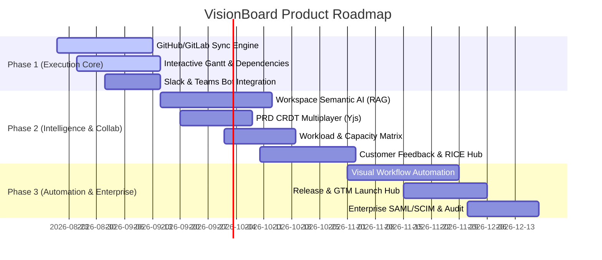

# VisionBoard — High-Value Feature Backlog & Product Roadmap 🚀

> **Reference Document**: This document outlines prioritized, high-value features missing from the current application implementation. Each feature includes its business justification, user benefit, technical architecture, schema requirements, and implementation checklist.

---

## 📊 1. RICE Prioritization & Strategic Ranking

| Rank | Feature Name | Target Persona | Reach (1-10) | Impact (0.25-3) | Confidence | Effort (Wks) | RICE Score | Target Phase |
| :--- | :--- | :--- | :---: | :---: | :---: | :---: | :---: | :--- |
| **#1** | **Bidirectional Git & VCS Sync Engine** | Eng / PM | 9 | 3.0 | 95% | 3.5 | **732** | Phase 1 (Next Up) |
| **#2** | **Interactive Gantt & Auto-Scheduling Engine** | PM / Exec | 8 | 2.5 | 90% | 3.0 | **600** | Phase 1 (Next Up) |
| **#3** | **Workspace Semantic AI Copilot & Document RAG** | All Roles | 10 | 2.5 | 85% | 4.0 | **531** | Phase 2 (Mid-Term) |
| **#4** | **Slack & Microsoft Teams Collaboration Suite** | All Roles | 9 | 2.0 | 95% | 2.0 | **855** | Phase 1 (Next Up) |
| **#5** | **Customer Feedback Portal & RICE Scoring Hub** | PM / Growth | 7 | 2.5 | 90% | 3.5 | **450** | Phase 2 (Mid-Term) |
| **#6** | **Visual Workflow Automation Engine** | PM / Admin | 6 | 2.0 | 85% | 4.0 | **255** | Phase 3 (Scale) |
| **#7** | **Team Workload & Capacity Planning Matrix** | Eng / PM | 7 | 2.0 | 85% | 2.5 | **476** | Phase 2 (Mid-Term) |
| **#8** | **Collaborative Rich-Text PRD CRDT Multiplayer** | PM / Eng | 8 | 1.5 | 90% | 2.5 | **432** | Phase 2 (Mid-Term) |
| **#9** | **Release Management & GTM Launch Control Hub** | Marketing / PM | 6 | 2.0 | 80% | 3.0 | **320** | Phase 3 (Scale) |
| **#10**| **Enterprise SAML SSO, SCIM & Audit Trail** | Admin / Exec | 4 | 3.0 | 95% | 2.5 | **456** | Phase 3 (Enterprise) |

---

## 🎯 2. Detailed Feature Specifications & Implementation Checklists

---

### 1. Bidirectional Developer Ecosystem & VCS Sync Engine (GitHub / GitLab)
**Priority**: `P0 — Immediate` | **Effort**: `3.5 Weeks` | **Score**: `732`

- **Problem**: Developers must manually update task statuses in VisionBoard, leading to stale boards and abandoned workspaces.
- **Solution**: Auto-link GitHub/GitLab pull requests, commits, and branch names to `Task` cards via webhooks and OAuth app connections.
- **Core Capabilities**:
  - [ ] GitHub App integration with OAuth token exchange and webhook receiver (`/api/integrations/github/webhook`).
  - [ ] Branch and PR naming regex matcher (e.g., `feat/VB-104-auth`, `Fixes #VB-205`).
  - [ ] Auto-transition task to `in_review` when PR is opened.
  - [ ] Auto-transition task to `done` and recalculate Milestone/Goal health when PR merges.
  - [ ] Render linked PR status, reviewers, and CI build checks in `CardDetailPanel.tsx`.
- **Target Schema Additions**:
  ```prisma
  model GitIntegration {
    id            String    @id @default(cuid())
    workspaceId   String
    provider      String    // "github" | "gitlab"
    repoId        String
    repoName      String
    installationId String?
    accessToken   String?
    createdAt     DateTime  @default(now())
    workspace     Workspace @relation(fields: [workspaceId], references: [id], onDelete: Cascade)
    links         TaskGitLink[]
  }

  model TaskGitLink {
    id              String         @id @default(cuid())
    taskId          String
    integrationId   String
    prNumber        Int?
    prTitle         String?
    prUrl           String?
    prStatus        String?        // "open" | "merged" | "closed" | "draft"
    branchName      String?
    commitSha       String?
    createdAt       DateTime       @default(now())
    task            Task           @relation(fields: [taskId], references: [id], onDelete: Cascade)
    integration     GitIntegration @relation(fields: [integrationId], references: [id], onDelete: Cascade)
  }
  ```

---

### 2. Interactive Gantt & Auto-Scheduling Dependency Engine
**Priority**: `P0 — Immediate` | **Effort**: `3.0 Weeks` | **Score**: `600`

- **Problem**: Current `RoadmapView` is a static CSS timeline that doesn't allow drag-to-reschedule, dependency wiring, or cascade shift calculations.
- **Solution**: Dynamic interactive Gantt canvas with Finish-to-Start (FS) constraints and Critical Path Method (CPM).
- **Core Capabilities**:
  - [x] Drag-to-resize duration and drag-to-shift milestone start/target dates.
  - [x] Visual dependency connectors (FS, SS, FF) with arrow lines between milestone/task nodes.
  - [x] Directed Acyclic Graph (DAG) validation & circular dependency detection.
  - [x] Cascade auto-scheduling: shifting an upstream milestone automatically prompts/shifts downstream dependents.
  - [x] Critical Path highlighting (CPM) with zero-slack visual badge.
  - [x] Baseline vs. Actual variance overlay to track schedule drift over time.
- **Target Schema Additions**:
  ```prisma
  model TaskDependency {
    id             String   @id @default(cuid())
    predecessorId  String
    successorId    String
    type           String   @default("FS") // FS, SS, FF, SF
    lagDays        Int      @default(0)
    createdAt      DateTime @default(now())
  }
  ```

---

### 3. Workspace Semantic AI Copilot & Multi-Document RAG
**Priority**: `P0 — Immediate` | **Effort**: `4.0 Weeks` | **Score**: `531`

- **Problem**: Knowledge is fragmented across PRDs, comments, goals, and sprint notes. AI can only execute isolated one-shot prompts.
- **Solution**: Vectorize workspace knowledge (`pgvector`) and deploy a floating AI Copilot that answers strategic questions with source citations.
- **Core Capabilities**:
  - [x] Configure `pgvector` extension in PostgreSQL and Prisma schema.
  - [x] Chunk and embed PRDs (`Document`), task comments, and goal specs on create/update.
  - [x] Global Copilot drawer component (`<AICopilotDrawer />`) accessible across all workspace views.
  - [x] Natural language Q&A: *"What were the key blockers in Q2 sprint 4?"*, *"Draft a spec for Stripe webhooks based on our docs"*.
  - [x] Real-time Server-Sent Events (SSE) streaming with interactive citation badges linking to exact docs/tasks.
  - [x] One-click Weekly Executive Summary & Standup Generator.

---

### 4. Slack & Microsoft Teams Bi-directional Collaboration Suite
**Priority**: `P0 — Immediate` | **Effort**: `2.0 Weeks` | **Score**: `855`

- **Problem**: Notifications are locked inside the app; team members miss urgent blockers and task assignments.
- **Solution**: Native Slack App (`@slack/bolt`) and Microsoft Teams Webhook connectors with interactive Block Kit action cards.
- **Core Capabilities**:
  - [ ] OAuth flow to connect workspace to a Slack channel (`/api/integrations/slack/oauth`).
  - [ ] Interactive task assignment cards: acknowledge, mark `done`, or reassign directly in Slack.
  - [ ] Blocker escalation alerts dispatched directly to the assigned team lead.
  - [ ] Slash command `/visionboard create [task title]` to capture action items from chat.
  - [ ] Daily Morning Digest DM summarizing upcoming deadlines and blocked dependencies.

---

### 5. Customer Feedback Ingestion & RICE Opportunity Scoring Hub
**Priority**: `P1 — Near-Term` | **Effort**: `3.5 Weeks` | **Score**: `450`

- **Problem**: Product managers lack a unified repository for customer feature requests and feedback, making prioritization subjective.
- **Solution**: Dedicated Feedback Hub with public vote boards, CSV/Intercom ingestion, AI Voice-of-Customer clustering, and RICE scoring.
- **Core Capabilities**:
  - [ ] Centralized Feedback Inbox (`/workspace/[id]/feedback`).
  - [ ] Ingest feedback via API, CSV, Intercom, or public feature voting board.
  - [ ] AI semantic clustering: group duplicate requests into unified "Opportunity Themes".
  - [ ] Interactive RICE (Reach, Impact, Confidence, Effort) and WSJF prioritization table.
  - [ ] Link Feedback clusters directly to `Goal` or `Milestone` items; auto-notify customers when shipped.

---

### 6. Visual No-Code Workflow Automation Engine
**Priority**: `P1 — Near-Term` | **Effort**: `4.0 Weeks` | **Score**: `255`

- **Problem**: Routine administrative tasks (reassignments, escalations, channel alerts) require manual effort.
- **Solution**: Visual "When [Trigger] If [Condition] Then [Action]" rule builder.
- **Core Capabilities**:
  - [ ] Rule Builder UI (`/workspace/[id]/automations`).
  - [ ] Triggers: `task_status_changed`, `milestone_delayed`, `goal_health_degraded`, `task_created`.
  - [ ] Conditions: role filters, priority filters, tag matchers, overdue days.
  - [ ] Actions: assign user, post Slack message, update priority, create sub-tasks, bump dates.
  - [ ] Execution audit log and loop-detection safeguard.

---

### 7. Team Workload, Capacity & Resource Allocation Matrix
**Priority**: `P1 — Near-Term` | **Effort**: `2.5 Weeks` | **Score**: `476`

- **Problem**: Engineering and Product Leads cannot see individual member capacity, leading to unbalanced sprints and burnout.
- **Solution**: Visual heatmap of member bandwidth vs. assigned story points across active sprints.
- **Core Capabilities**:
  - [ ] Team Capacity Matrix View (`/workspace/[id]/workload`).
  - [ ] Story points vs. target capacity calculation per engineer.
  - [ ] Visual overload indicators (>100% capacity in red).
  - [ ] Drag-and-drop task rebalancing between team members.
  - [ ] Team availability calendar (holidays, time off, part-time percentages).

---

### 8. Real-Time Collaborative Rich-Text PRD Editing (CRDT / Yjs)
**Priority**: `P1 — Near-Term` | **Effort**: `2.5 Weeks` | **Score**: `432`

- **Problem**: Concurrent edits in `DocEditor.tsx` cause overwrite race conditions.
- **Solution**: Bind TipTap editor to Yjs CRDTs over the existing Node.js WebSocket backend (`socket.ts`).
- **Core Capabilities**:
  - [ ] Integrate `y-tiptap` and `y-websocket` provider into `DocEditor.tsx`.
  - [ ] Live multi-cursor presence with teammate avatars and color-coded selection ranges.
  - [ ] Block-level inline commenting with resolved/unresolved threads and @mentions.
  - [ ] Document version history snapshotting and rollback.

---

### 9. Release Management & Go-To-Market (GTM) Launch Control Hub
**Priority**: `P2 — Strategic` | **Effort**: `3.0 Weeks` | **Score**: `320`

- **Problem**: Marketing and sales are disconnected from engineering release readiness.
- **Solution**: Release bundling dashboard (`vX.Y.Z`) linking code delivery to GTM launch checklists and AI changelog generation.
- **Core Capabilities**:
  - [ ] Release Hub (`/workspace/[id]/releases`) with release freeze, staging, and GA target dates.
  - [ ] Multi-department GTM checklists (Docs, Marketing Blog, Sales Enablement, Support Training).
  - [ ] AI Public Changelog & Release Notes Generator from completed sprint tasks.
  - [ ] Feature flag status integration (PostHog, LaunchDarkly).

---

### 10. Enterprise Governance: SAML 2.0 SSO, SCIM & Immutable Audit Trail
**Priority**: `P2 — Enterprise Scale` | **Effort**: `2.5 Weeks` | **Score**: `456`

- **Problem**: Enterprise security reviews reject adoption without SAML/SCIM and compliance auditing.
- **Solution**: Enterprise identity integration, automated user provisioning, and searchable compliance audit logs.
- **Core Capabilities**:
  - [ ] SAML 2.0 / OIDC SSO integration (Okta, Azure AD / Entra, Google Workspace).
  - [ ] SCIM 2.0 API (`/api/scim/v2/Users`) for automatic provisioning and deprovisioning.
  - [ ] Immutable Compliance Audit Trail recording workspace actions with actor, IP, timestamp, and diff.
  - [ ] Custom RBAC matrix with granular capability bitmasks.

---

## 🗺️ 3. Phased Execution Roadmap



---

## 📌 4. How to Use This File
1. Keep this file updated as features transition through `Planning` $\rightarrow$ `In Development` $\rightarrow$ `Shipped`.
2. Reference the schema snippets in section 2 when writing database migrations in `prisma/schema.prisma`.
3. Check off tasks in the implementation checklists above as PRs are merged.
