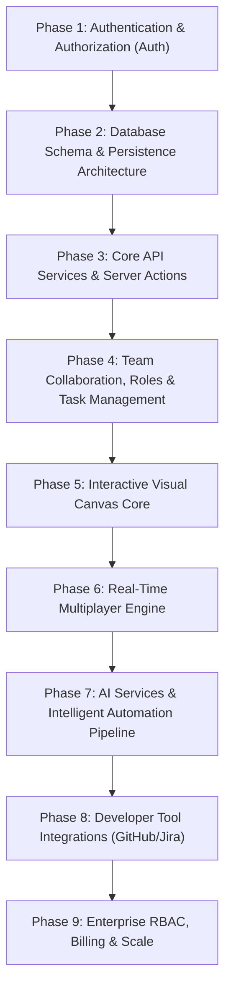

# VisionBoard — System Architecture & Implementation Roadmap 🗺️

> **Notice for Humans & AI Agents**: This document serves as the authoritative blueprint for VisionBoard's full-stack architecture, feature requirements, technology choices, and multi-phase implementation roadmap. Reference this file during any feature addition, refactoring, or backend integration.

---

## 🎯 1. What We Want to Implement

VisionBoard is an AI-native product management and engineering workspace platform that unifies high-level strategic planning, contextual documentation, agile execution, and real-time multiplayer collaboration.

### Core Product Capabilities
1. **Interactive Visual Canvas Board**:
   - Dynamic 2D node canvas (`React Flow`) acting as the main visual hub where team members and managers view real-time progress across initiatives.
   - Manager view allows leaders to zoom out and inspect the exact progress, status, and bottlenecks of team members they manage.
2. **Dedicated "My Tasks" Hub**:
   - Centralized task management page displaying all tasks assigned to the current user across workspaces.
   - Status filters (To Do, In Progress, Blocked, Done), priority flags, estimated capacity, and direct links to parent PRDs and roadmap items.
3. **AI Workflow Engines**:
   - **AI Roadmap Generator**: Converts raw specs, user feedback, and business goals into milestone-driven product roadmaps.
   - **Goal Deconstructor**: Breaks quarterly OKRs into sub-tasks, owner assignments, and sprint timelines.
   - **Predictive Progress Insights**: Velocity and delay forecasting to alert teams before release dates slip.
   - **Natural Language Board Commands**: Plain-text actions to update boards, assign resources, and modify dependencies.
4. **Connected Documentation**:
   - Rich-text PRDs, technical specs, and meeting notes linked directly to tasks and roadmaps.
5. **Role-Tailored Dashboards**:
   - **Product Managers**: Feature roadmaps, Goal Health Scores, customer feedback loops.
   - **Executive Strategy**: Portfolio alignment, Resource Investment Matrix, automated executive summary generator.
   - **Engineering & Ops**: Sprint velocity, cross-team blocker dependency graphs, CI/CD deployment health.
   - **Marketing & Growth**: GTM campaign synchronization mapped to upcoming feature releases.
6. **Preset Workflow Templates**:
   - OKR Boards, Product Roadmaps, Quarterly Planning, Sprint Execution.
7. **Enterprise Multi-Tenancy & Security**:
   - Role-Based Access Control (RBAC), Workspace isolation, SAML/SSO, and Audit Logging.

---

## 🛠️ 2. How We Want to Implement It (Technology Stack)

```
┌─────────────────────────────────────────────────────────┐
│                 VisionBoard Web Client                  │
│             (Next.js App Router + Tailwind)             │
└──────────────────────────┬──────────────────────────────┘
                           │ WebSockets / REST / SSE
┌──────────────────────────▼──────────────────────────────┐
│                    API Service Layer                    │
│            (Node.js / Next.js Serverless)               │
└──────┬───────────────────┬───────────────────┬──────────┘
       │                   │                   │
┌──────▼──────┐     ┌──────▼──────┐     ┌──────▼──────┐
│ Database    │     │ AI Pipeline │     │ Integrations│
│ PostgreSQL  │     │ OpenAI /    │     │ GitHub /    │
│ + Prisma    │     │ Gemini LLM  │     │ Jira Sync   │
└─────────────┘     └─────────────┘     └─────────────┘
```

### Layer Specifications

* **Frontend**:
  - **Framework**: Next.js (App Router, Server Components, TypeScript).
  - **Styling**: Tailwind CSS utilizing strict tokens in `globals.css` and reusable elements in `components/reusables/`.
  - **State Management**: TanStack Query (React Query) for server state caching + Zustand for local UI state.
  - **Visualizations**: `@xyflow/react` (React Flow) for interactive roadmap nodes and dependency graphs.
  - **Rich Text Editor**: TipTap / BlockNote (ProseMirror-based) for collaborative PRDs.

* **Backend & Persistence**:
  - **Database**: PostgreSQL (via Supabase or AWS Aurora Serverless) with `pgvector` for semantic document search.
  - **ORM**: Prisma or Drizzle ORM for type-safe migrations and schema management.
  - **Cloud Storage**: AWS S3 / Cloudflare R2 for document file attachments and images.

* **Real-Time & Multiplayer**:
  - **Engine**: Yjs CRDTs + Liveblocks or PartyKit over WebSockets for low-latency live board and doc collaboration.
  - **Caching & Pub/Sub**: Redis for session state, rate limiting, and WebSocket message backplane.

* **AI Engine & Job Processing**:
  - **LLMs**: OpenAI GPT-4o / Google Gemini 1.5 Pro via Vercel AI SDK.
  - **Structured Outputs**: Zod / Instructor schema validation to ensure LLM responses return parseable JSON.
  - **Background Queue**: BullMQ (Redis-backed) to handle long-running AI roadmap generation asynchronously.

* **Auth & Integrations**:
  - **Authentication**: Clerk / WorkOS (OAuth 2.0, SAML SSO, Workspace Organization switching).
  - **Integrations**: GitHub, GitLab, and Jira Webhooks to sync PR merges, commits, and issue statuses automatically.

---

## 📊 3. Implementation Phases

The platform will be built in **9 distinct, incremental phases**:



### Phase 1: Authentication & Authorization (Auth)
* [x] Integrate Auth provider (Clerk / WorkOS / Supabase Auth) with OAuth 2.0 and email/password flows.
* [x] Configure Auth middleware for Next.js App Router to protect private routes and API endpoints.
* [x] Implement session management, user token verification, and workspace authentication context.
* [x] Build sign-in, sign-up, password reset, and organization onboarding screens.

### Phase 2: Database Schema & Persistence Architecture
* [ ] Define PostgreSQL database schema with Prisma / Drizzle ORM (`User`, `Organization`, `Workspace`, `WorkspaceMember`, `Role`, `Project`, `Sprint`, `Task`, `CanvasNode`, `CanvasEdge`, `Document`, `OKR`).
* [ ] Implement database migration scripts, seed scripts, and index strategy (e.g., composite indices on `workspace_id`).
* [ ] Enforce strict multi-tenant isolation constraints at the schema level.

### Phase 3: Core API Services & Server Actions
* [ ] Create REST / Next.js Server Action API handlers for CRUD operations on workspaces, projects, tasks, documents, and canvas items.
* [ ] Implement Zod input validation schemas for all incoming API payloads and parameters.
* [ ] Create reusable database access controllers with mandatory `workspace_id` tenant filtering.
* [ ] Connect frontend components to live API endpoints using TanStack Query (React Query) for state caching.

### Phase 4: Team Collaboration, Roles & Task Management
* [ ] Build Team Member Management UI: Invite members via email, pending invitations, member removal.
* [ ] Implement Role-Based Access Control (RBAC): Define permissions for Admin, Manager, Contributor, and Viewer roles.
* [ ] Create "My Tasks" Hub: Filter tasks by status (To Do, In Progress, Blocked, Done), priority, due dates, and parent PRD links.
* [ ] Build Task Assignment & Delegation engine: Assign single or multiple owners, set estimated capacity, track member workload.
* [ ] Build Manager View: High-level overview of team progress, individual velocity, and work bottlenecks.

### Phase 5: Interactive Visual Canvas Core
* [ ] Build Interactive Visual Canvas Board using `@xyflow/react` (React Flow).
* [ ] Design node types: Task Cards, PRD Docs, Milestone Nodes, Goal Nodes, and Connector Edges.
* [ ] Implement canvas CRUD operations: Create nodes, connect nodes, update positions, zoom/pan, delete items.
* [ ] Persist canvas layout state to the database via API layer.
* [ ] Build Manager Zoom Out mode for visual team progress overview.

### Phase 6: Real-Time Multiplayer Engine
* [ ] Set up Yjs CRDT providers and Liveblocks / PartyKit WebSocket servers.
* [ ] Enable real-time canvas multiplayer sync: Drag-and-drop node movement, live cursor presence, active user avatars.
* [ ] Integrate collaborative rich-text editing (TipTap / BlockNote) for connected PRDs and documents.
* [ ] Implement optimistic UI updates with automatic rollback on network disconnection.
* [ ] Configure Redis pub/sub backplane for high-concurrency WebSocket message dispatching.

### Phase 7: AI Services & Intelligent Automation Pipeline
* [ ] Deploy Redis + BullMQ (or Inngest) worker queue infrastructure for asynchronous AI jobs.
* [ ] Implement **AI Roadmap Generator** endpoint using Vercel AI SDK and structured Zod outputs.
* [ ] Build **Goal Deconstructor** pipeline to split quarterly OKRs into actionable sprint tasks.
* [ ] Set up `pgvector` index over PRDs for semantic RAG search and natural language board commands.
* [ ] Stream AI token responses to client UI components via Server-Sent Events (SSE).

### Phase 8: Developer Tool Integrations
* [ ] Implement GitHub and Jira OAuth 2.0 integration flows.
* [ ] Build webhook handlers to sync PR merges, commits, and Jira issue statuses with VisionBoard tasks & canvas nodes.
* [ ] Implement automated CI/CD velocity tracking and deployment status widgets.

### Phase 9: Enterprise Controls, Billing & Scale
* [ ] Integrate Stripe for subscription tiers (Free, Startup, Growth, Enterprise) with feature-gating middleware.
* [ ] Configure SAML / Enterprise SSO integration.
* [ ] Set up PgBouncer connection pooling and database read replicas.
* [ ] Add audit logging, rate limiting, Sentry error monitoring, and telemetry.

---

## 🤖 Guidelines for AI Developer Agents

When working on this repository, all AI agents **MUST** follow these rules:

1. **Strict Design Tokens**: Never hardcode hex values. Use Tailwind tokens (`text-blue`, `bg-offwhite`, `border-border`) defined in `globals.css`.
2. **Reusable UI First**: Prioritize existing elements in `components/reusables/` (`<PrimaryButton>`, `<SecondaryButton>`, `<Logo>`).
3. **Type Safety**: Maintain strict TypeScript typing. Ensure all API request/response structures are validated with Zod.
4. **Tenant Isolation**: Always pass and enforce `workspace_id` filtering in backend database queries.
5. **Async AI**: Never run LLM operations synchronously inside fast HTTP response handlers; route long-running AI requests through the queue.
