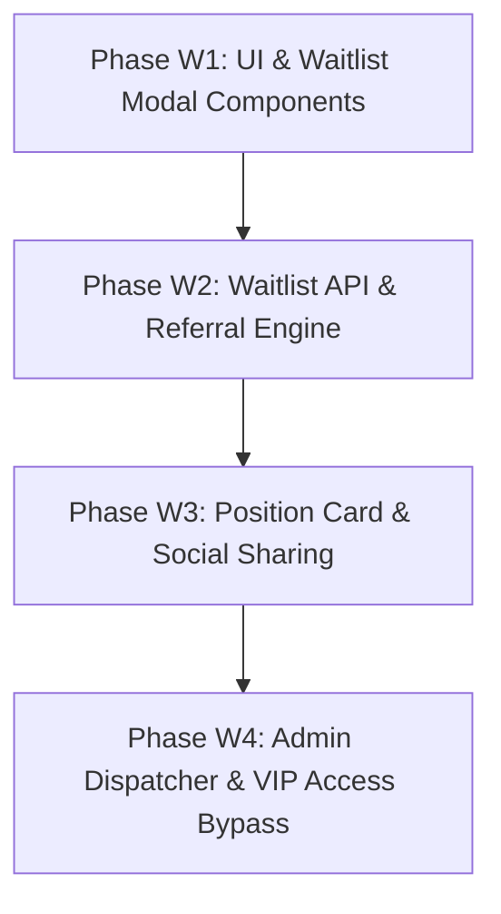

# VisionBoard — Waitlist Implementation Plan 🚀

> **Document Version**: 1.0.0  
> **Status**: Approved Strategy  
> **Target Audience**: Product Managers, Engineering Leaders, Early Access Design Partners  
> **Primary Goal**: Capture, score, engage, and convert high-intent product & engineering leads through a gamified, viral waitlist before full public launch.

---

## 🎯 1. Overview & Business Objectives

Before launching full multi-tenant workspace access, VisionBoard will deploy an enterprise-grade **Viral Waitlist System**. This system will capture early adopters, validate market demand, gather feature preferences from product leaders, and create viral growth through a position-boosting referral loop.

### Key Objectives
1. **High-Converting Lead Capture**: Collect qualified prospect metadata (email, role, company size, primary pain point).
2. **Viral Referral Loop**: Allow users to bump up their position on the waitlist by sharing custom referral links.
3. **VIP Invite Bypass**: Provide instant access codes for strategic enterprise design partners and investor invites.
4. **Admin Invite Dispatcher**: Empower admins to inspect waitlist entries, filter high-value leads, and batch-invite teams.
5. **Seamless Auth Onboarding Bridge**: Automatically transition invited users from the waitlist directly into the Phase 1 Authentication & Onboarding flow.

---

## 📐 2. Waitlist Experience & User Flow

```
┌───────────────────────────────┐
│     VisionBoard Homepage      │
│  "Join Exclusive Access" CTA  │
└───────────────┬───────────────┘
                │
                ▼
┌───────────────────────────────┐
│     Waitlist Registration     │
│ (Email, Role, Company, Goal)  │
└───────────────┬───────────────┘
                │
                ▼
┌───────────────────────────────┐
│   Gamified Status Dashboard   │
│ Position Card + Referral Link │
└───────────────┬───────────────┘
                │
    ┌───────────┴───────────┐
    │                       │
    ▼                       ▼
Share Link (+5 Spots)    Admin Sends Magic Invite Token
                            │
                            ▼
                     Redirect to /signup
                     (Bypasses Waitlist)
```

### Flow Breakdown

1. **Entry Point (Homepage Hero CTA)**:
   - Primary CTA switches to **"Get Early Access"** or **"Join Waitlist"**.
   - Displays live ticker: *"Joined by 1,480+ Product Leaders from Stripe, Vercel & Linear"*.

2. **Waitlist Registration Modal**:
   - Collects:
     - **Work Email** (validates against public disposable domains).
     - **Full Name**.
     - **Company / Organization**.
     - **Team Size** (1-10, 10-50, 50-200, 200+).
     - **Primary Role** (Product Manager, Engineering Lead, Founder/Executive, Product Designer).
     - **Most Anticipated Feature** (AI Roadmaps, Visual Canvas, GitHub/Jira Sync, OKR Deconstruction).
     - **VIP Access Code** (Optional field for instant bypass).

3. **Gamified Status Card**:
   - Immediately displays user position (e.g., **"You are #142 in line"**).
   - Generates unique referral link: `https://visionboard.io/?ref=ALEX992`.
   - Dynamic Referral Perks:
     - Invite 1 teammate ➔ Move up **5 spots**.
     - Invite 3 teammates ➔ Jump into **Top 20 VIP Queue**.
     - Share on LinkedIn / X ➔ Gain **+2 spots**.

4. **Email Confirmation**:
   - Instant welcome email containing their current position and referral link.

5. **Magic Invite Activation**:
   - When an admin approves an entry, a single-use token email is sent (`https://visionboard.io/signup?inviteToken=tok_98234`).
   - Clicking the link populates their profile and unlocks access to the app workspace.

---

## 🛠️ 3. Technical Architecture & Database Schema

### Database Table (`WaitlistEntry`)

```prisma
model WaitlistEntry {
  id             String    @id @default(cuid())
  email          String    @unique
  fullName       String
  company        String?
  teamSize       String?
  role           String
  painPoint      String?
  referralCode   String    @unique
  referredBy     String?   // Referral code of the inviter
  referralCount  Int       @default(0)
  position       Int
  status         WaitlistStatus @default(PENDING) // PENDING, INVITED, REGISTERED, EXPIRED
  inviteToken    String?   @unique
  invitedAt      DateTime?
  createdAt      DateTime  @default(now())
  updatedAt      DateTime  @updatedAt

  @@index([email])
  @@index([status])
  @@index([position])
}

enum WaitlistStatus {
  PENDING
  INVITED
  REGISTERED
  EXPIRED
}
```

---

## 🔌 4. API Endpoints Specification

### 1. `POST /api/waitlist/join`
Submit form to join waitlist. Calculates initial position based on queue length and referral code.

**Request Payload:**
```json
{
  "email": "alex.pm@company.com",
  "fullName": "Alex Vance",
  "company": "Acme Labs",
  "teamSize": "10-50",
  "role": "product_manager",
  "painPoint": "AI Roadmaps",
  "referredBy": "SARAH882",
  "vipCode": ""
}
```

**Response:**
```json
{
  "success": true,
  "data": {
    "position": 142,
    "referralCode": "ALEX992",
    "referralLink": "https://visionboard.io/?ref=ALEX992",
    "status": "PENDING"
  }
}
```

---

### 2. `GET /api/waitlist/status?email=alex.pm@company.com`
Fetches real-time position, referral stats, and invitation status.

**Response:**
```json
{
  "success": true,
  "data": {
    "position": 132,
    "totalWaitlist": 1850,
    "referralCount": 2,
    "referralLink": "https://visionboard.io/?ref=ALEX992",
    "status": "PENDING"
  }
}
```

---

### 3. `POST /api/waitlist/invite-code`
Validates VIP access codes to grant instant access.

---

### 4. `GET /api/admin/waitlist`
Protected admin API listing waitlist leads with filters by status, role, and company size.

---

### 5. `POST /api/admin/waitlist/dispatch-invites`
Batch dispatches magic invite links to selected candidates.

---

## 📊 5. Implementation Roadmap (Waitlist Version)



### Phase W1: UI & Waitlist Modal Components
* [ ] Build `<WaitlistModal>` component with multi-step form (Role, Company, Pain Point).
* [ ] Update homepage Hero section with "Join Exclusive Waitlist" CTA button and social proof counter widget.
* [ ] Add responsive drawer view for mobile devices.

### Phase W2: Waitlist API & Referral Engine
* [ ] Implement `WaitlistEntry` model in Prisma / local state DB controller.
* [ ] Build `POST /api/waitlist/join` with input validation, duplicate email prevention, and referral position jump logic.
* [ ] Implement unique referral code generator (`ALEX123`).

### Phase W3: Gamified Position Card & Social Sharing
* [ ] Create `<WaitlistStatusCard>` displaying position number, queue progress bar, and referral stats.
* [ ] Add 1-click share buttons for LinkedIn, X (Twitter), and Email with pre-filled copy.
* [ ] Implement copy-to-clipboard for custom referral URLs.

### Phase W4: Admin Dispatcher & VIP Bypass Middleware
* [ ] Build `/admin/waitlist` dashboard view for inspecting, filtering, and inviting waitlist leads.
* [ ] Implement VIP access code verification (`POST /api/waitlist/invite-code`) that unlocks instant registration.
* [ ] Wire invite tokens to bypass Next.js `middleware.ts` restrictions into `/signup`.

---

## 🤖 Guidelines for AI Agents Implementing Waitlist

1. **Design Tokens**: Strictly use existing Tailwind v4 theme variables (`bg-offwhite`, `text-ink`, `text-blue`, `border-border`).
2. **Instant Feedback**: Provide clear inline loading states and position updates without full page reloads.
3. **Persisted State**: Save user waitlist email in `localStorage` (`vb_waitlist_email`) so returning users automatically see their status card.
4. **Privacy Compliant**: Ensure GDPR compliance with explicit consent checkboxes and un-trackable referral handles.
